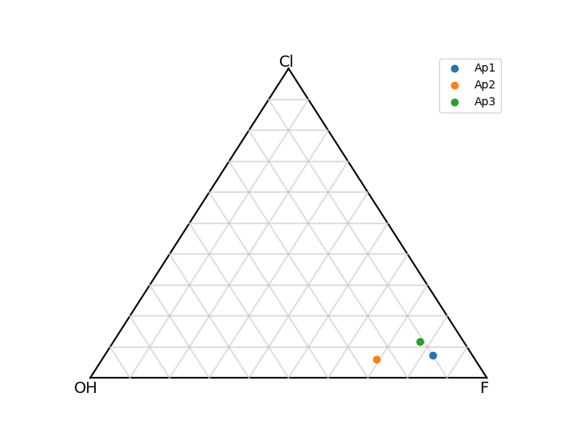
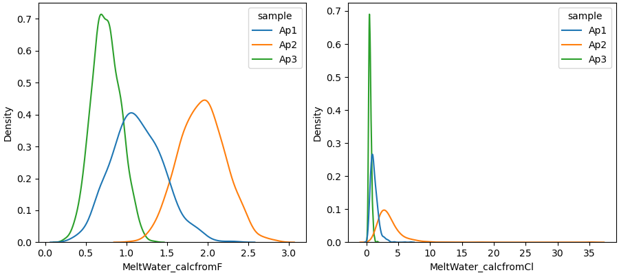

pyAp - Command line commands
=============

pyAp includes a python script integrated all models and runs with command line. To use the script, one should change the working directory to the example folder:

.. code-block:: bash

    $ cd example

Note that for windows users, the command line commands work in Anaconda prompt or shell like terminal. For Mac users, the commands can run directly in the terminal. Excute the script with a python command:

.. code-block:: bash

    $ python run_all-in-one.py

    Let us start!

    Calculate mole fractions and a.p.f.u. ?(y/n):y

By choosing ``y`` as yes and ``n`` as no to continue or skip the calculation.

.. code-block:: bash

    >> results saved to csv!

             SI        TI        AL  ...        SR  stoi,(Ca/P-5/3)/(5/3)*100%  sample
    0  0.017412  0.013097  0.020520  ...  0.010095                    3.656599     Ap1
    1  0.017514  0.013175  0.020641  ...  0.010155                    3.656599     Ap2
    2  0.017419  0.013103  0.020528  ...  0.010100                    3.656599     Ap3

    [3 rows x 19 columns]

Then we continue to plot the F-Cl-OH ternary diagram of apatite:

.. code-block:: bash

    Plot F-Cl-OH ternary ?(y/n):y

    Close the plot window for next step. Before closing it you could save the plot by clicking on the "save" button in the same window.

Calculate melt H :sub:`2` O concentration:
.. code-block:: bash

    Calculate melt H2O concentraion?(y/n): y

    Use mole fractions just calculated?(y/n): y

The MCS is also integrated in the script, the default is to run 1000 times:

.. code-block:: bash

    Run MC for error propagation?(y/n): y
    >> Simulation starts ...

    >> Simulation completed

    >> mc = 1000. All MC results are saved in csv file: outputs_melt_water_allin1.csv

       MeltWater_calcfromF  ...  MeltWater_Cl_error,100%
    0             1.101500  ...                48.146486
    1             1.937091  ...                43.507000
    2             0.744809  ...                35.141224

    [3 rows x 9 columns]

    >> The median and standard deviation of MC results are saved in csv file: outputs_melt_water_allin1.csv
    Close the plot window for next step. Before closing it you could save the plot by clicking on the "save" button in the same window.

